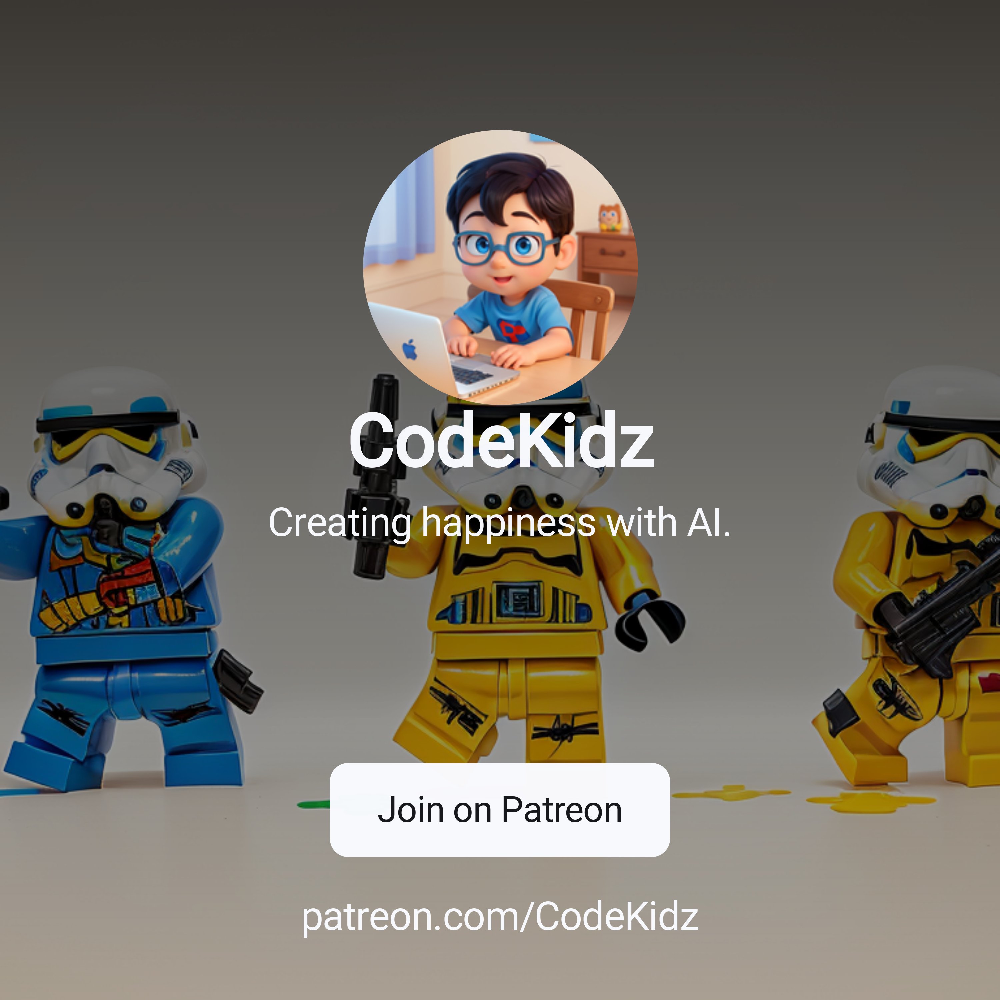

# AI-doodle-book-tutorial

This repo contains the resources and scripts for the [AI doodle book tutorial](https://medium.com/@jingxin/create-a-doodle-book-with-ai-without-writing-a-single-line-of-code-bbdacde0e214), they will batch the steps in the entire pipeline, simplifying the tedious operations.

- `create_canny.py` put all your base images in the images folder, and run this script, it will create the canny edge images and saved in canny folder. (Batching step 3).
- `doodle_book.fig` contains serveral frames of the book, you can combine all your doodles into this file, and export them as a pdf. (As mentioned in the last step).

You can find my works right here, they can be downloaded for free, or join [our discord server](https://discord.gg/jtSE7EEeAK) to talk about new ideas and share your works.

- [creative-sketch-animals](https://codekidz.gumroad.com/l/creative-sketch-animals)
- [creative-sketch-blocks](https://codekidz.gumroad.com/l/creative-sketch-blocks)

Welcome to follow my Patreon account! I'll try my best to come up with a new set of doodle works with various themes every month (mainly depends on how fast my son can finish coloring them 😉).

